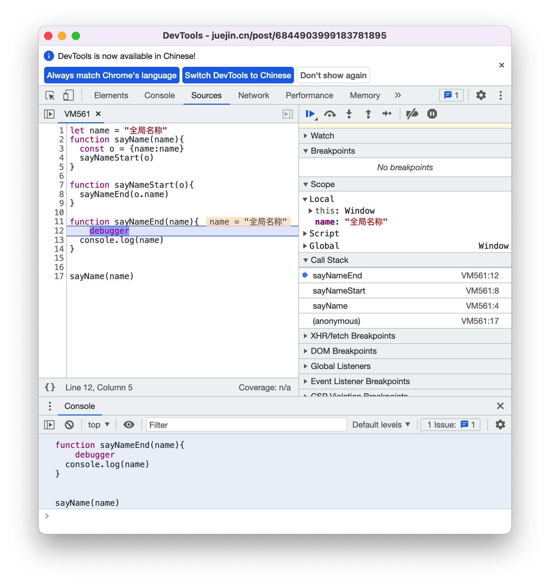
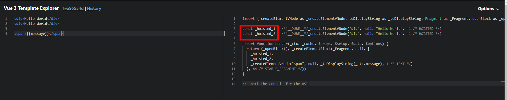

# 栈
栈：一种遵循 后进先出（LIFO）原则的有序集合。新添加和待删除的数据都保存在栈的同一端栈顶，另一端就是栈底。新元素靠近栈顶，就元素靠近栈底。栈由编译器自动分配释放。栈使用一级缓存。调用时处于存储空间，调用完毕自动释放

可以理解为 出口和入口是同一个，都在栈顶。

## 用于基本数据结构的存储（存储栈）

JS中，数据类型分为基本数据类型（原始值）和引用数据（对象）类型

基本数据类型：
- string
- number
- boolean
- undefined
- null
- symbol
- bigint

在内存中这几种数据类型存储在栈空间，我们按值访问。原型类型都存储在栈内存中，是大小固定并且有序的。

## 执行栈（函数调用栈）

> 执行上下文（执行环境): JS中每一个可执行代码，在解释执行前，都会创建一个可执行上下文

简单来说，执行上下文就是一种对 `javascript`代码执行环境(当前执行环境中的变量、函数声明、参数（arguments）、作用域链、this等信息)的抽象概念，也就是说只要有 `javascript` 代码运行，那么它就一定是在运行在执行上下文中。执行上下文定义了变量或函数有权访问的其它数据，据定了它们各自的行为。每个执行环境（执行上下文）都有一个与之关联的变量对象，上下文中顶一的所有变量和函数都保存在这个对象中。虽然我们编写的代码无法访问这个对象，但解析器在处理数据时会在后台使用它。

- 全局执行上下文：只有一个，浏览器中的全局对象就是 `window` 对象, `this` 就指向这个全局对象，也是最外围的一个执行上下文
- 函数执行上下文：存在无数个，只有在函数被调用的时候才会被创建，每次调用函数都会创建一个新的执行上下文
- Eval 函数执行上下文： 指的是运行在 `eval` 函数中的代码，很少用而且不建议用

某个执行上下文中的所有代码执行完毕后，该环境被销毁，保存在其中的所有变量和函数顶一也随之销毁（但web浏览器中的全局上下文是直到应用程序退出--例如关闭网页或浏览器--时才会被销毁）

**执行栈**
> 也叫调用栈，具有LIFO(后进先出)结构，用于存储在代码执行期间创建的所有执行上下文，是追踪函数执行流的一种机制。

- 每调用一个函数，解释器就会把该函数添加进调用栈并开始执行
- 正在调用栈中执行的函数还调用了其它的函数，那么新函数也将会被添加进调用栈，一旦这个函数被调用，便会立即执行。
- 当前函数执行完毕后，解释器将其清楚调用栈，继续执行当前执行上下文中的剩余的代码
- 当分配的调用栈空间被占满时，会引发“堆栈溢出”的错误。

因为JS执行中最先进入全局环境，所以处于“栈底的永远是全局环境的执行上下文”。而处于“栈顶的是当前正在执行的上下文”，当函数调用完成后，他就会从栈顶被推出（理想的情况下，必报会阻止该操作。）

“全局环境只有一个，对应的全局执行上下文也只有一个，只有当页面被关闭之后，他才回从执行栈中被推出，否则一直存在于栈底“

```JS
let name = "全局名称"
function sayName(name){
  const o = {name:name}
  sayNameStart(o)
}

function sayNameStart(obj){
  sayNameEnd(obj.name)
}

function sayNameEnd(name){
  console.log(name)
}

sayName(name)
```



## 创建一个栈（实现栈方法）
创建一个栈，并且这个栈 包含一下方法

- push(elements):添加一个（或多个）新元素到栈顶
- pop():删除栈顶的元素，并返回该元素
- peek():返回栈顶的元素，不对栈进行任何操作
- isEmpty():检查栈是否为空
- size():返回栈的元素个数
- clear():清空栈

```JS

let stack = (function(){
  const items = new WeakMap()
  class Stack {
    constructor(){
      items.set(this,[])
    }

    getItems(){
      let s = items.get(this)
      return s
    }

    push(element){
      this.getItems().push(element)
    }

    pop(){
      return this.getItems().pop()
    }

    peek(){
      return this.getItems()[this.getItems.length-1]
    }

    isEmpty(){
      return this.getItems().length === 0
    }

    size(){
      return this.getItems().length
    }

    clear(){
      this.getItems() = []
    }
  }
  return Stack
})()

```


## 使用栈解决问题

### 进制转换问题

```JS
// 十进制转二进制
function divideBy2(decNumber){
  let remStack = new Stack(), rem,binaryString='';
  while(decNumber>0){
    rem=Math.floor(decNumber%2)
    remStack.push(rem)
    decNumber= Math.floor(decNumber/2)
  }
  while(!remStack.isEmpty()){
    binaryString+=remStack.pop().toString()
  }
}

// 任意进制转换的算法
function baseConverter(decNumber,base){
  let remStack = new Stack(),rem,binaryString='',digits='0123456789ABCDEF';
  while(decNumber>0){
    rem = Math.floor(decNumber % base)
    remStack.push(rem)
    decNumber = Math.floor(decNumber / base)
  }

  while(!remStack){
    binaryString += digits[remStack.pop()].toString()
  }
  return binaryString
}
```

## 栈溢出问题

不同浏览器堆调用栈的大小是有限制的，超过将出现栈溢出的问题。

检测不同浏览器堆调用栈的大小限制。可以用下面代码检验

```JS
let i = 0;
function recursiveFn(){
  i++;
  recursiveFn()
}

try{
  recursiveFn()
}catch(ex){
  console.log(`我的最大调用栈 i = ${i}  errorMsg = ${ex}`)
}

```

### 递归调用的栈溢出问题

```JS

function Fibonacci(n){
  if(n<=1){
    return 1
  }
  return Fibonacci(n-1) + Fibonacci(n-2)
}

Fibonacci(10) // 89
Fibonacci(100) // 超时
Fibonacci(500) // 超时

```

上面代码是一个阶乘函数，计算 n 的阶乘，最多需要保存 n个调用记录，复杂的O(n)；如果超出限制，会出现 栈溢出问题

**尾递归调用优化**

递归非常耗费内存，因为需要同时保存成千上百个调用帧，很容易发生“栈溢出”错误（stack overflow）

但对于 尾递归来说，由于只存在一个调用帧，所以永远不会发生“栈溢出”错误。

```JS
function Fibonacci2(n,ac1=1,ac2=1){
  if(n<1) return ac2;
  return Fibonacci2(n-1,ac2,ac1 + ac2)
}

Fibonacci2(100) // 573147844013817200000
Fibonacci2(1000) // 7.0330367711422765e+208
Fibonacci2(10000) // Infinity
```

由此可见，“尾调用优化”对递归操作意义重大，所以一些函数编程语言将其写入了语言规格。ES6 亦是如此，第一次明确规定，所有ECMAScript 的实现，都必须部署“尾调用优化”，这就是说，ES6 中只要使用尾递归，就不会发生栈溢出（或层层递归造成的超时），相对节省内存。

# 堆

堆，一般由操作人员（程序员）分配释放，若操作人员不分配释放，将由 OS 回收释放。分配方式类似链表。堆存储在二级缓存中。

JS的数据类型中的引用类型 存储在 堆中。

> Object 类型都存储在堆内存中，是大小不定，复杂可变的。Object类型数据的指针 存储在 栈内存中见，指针实际指向的值存储在堆内存空间。

**为什么会有堆内存、栈内存之分**
通常与垃圾回收机制有关。为了使程序运行时占用的内存最小。

当一个方法执行时，每个方法都会建立自己的内存栈，在这个方法内定义的变量将会逐个放入这块栈内存里，随着方法的执行结束，这个方法的内存栈也将自然销毁了。因此，所有在方法中定义的变量都是放在栈内存中的；
当我们在程序中创建一个对象时，这个对象将被保存到运行时数据区中，以便反复利用（因为对象的创建成本通常较大），这个运行时数据区就是堆内存。堆内存中的对象不会随方法的结束而销毁，即使方法结束后，这个对象还可能被另一个引用变量所引用（方法的参数传递时很常见），则这个对象依然不会被销毁，只有当一个对象没有任何引用变量引用它时，系统的垃圾回收机制才会在核实的时候回收它。


# 队列

队列遵循先进先出（FIFO）原则的一组有序集合。队列在尾部添加数据，在顶部删除数据。在现实中最常见的队列就是排队。先排队的先服务。

## 任务队列

JavaScript 是单线程，单线程任务被分为同步任务和异步任务。同步任务在调用栈中等待主线程依次执行，异步任务会在有了结果之后，将回调函数注册到任务队列中，等待主线程空闲（调用栈为空），放入执行栈等待主线程执行。



执行栈在执行完同步任务之后，如果执行栈为空，就回去检查微任务（MicroTask）队列是否为空，如果为空的话，就会去执行宏任务队列（MacroTask）。否则就会一次性执行完所有的微任务队列。每次一个宏任务执行完成之后，都回去检查微任务队列是否为空，如果不为空就会按照先进先出的方式执行完微任务队列。然后再执行下一个宏任务，如此循环执行。直到结束。

## 创建一个队列（实现队列方法）
一个队列类需要包含一下方法和属性

- enqueue(element(s)): 向队列尾部添加一个（或多个）元素
- dequeue():移除队列的第一项，并返回移除的元素
- front():返回队列的第一个元素 -- 最先被添加，最先被移除的元素
- isEmpty(): 判断队列是否为空
- size(): 返回队列的长度

```JS
// ES6语法实现Queue队列类，利用WeakMap来保存私有属性items,并用外层函数（闭包）来封装Queue类。

let Queuel = (function(){
  const items = new WeakMap()
  class Queuel {
    constructor(){
      items.set(this,[])
    }

    //获取队列
    getQueue(){
      return items.get(this)
    }

    // 添加元素
    enqueue(element){
      this.getQueue().push(element)
    }

    // 删除元素
    dequeue(){
      return this.getQueue().shift()
    }

    // 返回队列第一个元素
    front(){
      return this.getQueue()[0]
    }

    isEmpty(){
      return this.getQueue().length===0
    }

    size(){
      return this.getQueue().length
    }
  }
  return Queuel
})()


```
## 优先队列
元素的添加和删除基于优先级。常见的就是机场的登机顺序。头等舱和商务舱的优先级高于经济舱。实现优先队列，设置优先级。

```JS
// 优先队列

function PriorityQueue(){
  let items = []

  // 创建元素和它的优先级（priority 越大优先级越低）
  function QueueElement(element,priority){
    this.element = element
    this.priority = priority
  }

  // 添加元素（根据优先级添加）
  this.enqueue = function (element,priority){
    let queueElement = new QueueElement(element,priority)
    // 标记是否添加元素的优先级的值最大
    let added = false
    for(let i=0;i<items.length;i++){
      if(queueElement.priority < item[i].priority){
        items.splice(i,0,queueElement)
        added = true
        break
      }
    }
    if(!added){
      items.push(queueElement)
    }
  }

  // 删除元素
  this.dequeue = function(){
    return items.shift()
  }

  // 返回队列第一个元素
  this.front = function(){
    return items[0]
  }

  //返回队列是否为空
  this.isEmpty = function(){
    return items.length ===0
  }

  // 返回队列的长度
  this.size = function(){
    return items.length
  }

  // 打印队列
  this.print = function(){
    for(let i =0; i<items.length;i++){
      console.log(`${items[i].element} - ${items[i].priority}`)
    }
  }
}

```

## 循环队列（击鼓传花）

1、利用队列类创建一个队列
2、把当前玩击鼓传花游戏的所有人都放进队列
3、给定一个数字，迭代队列，从队列的开头移除一项，添加到队列的尾部（如游戏就是：你把花传给旁边的人，你就可以安全了）
4、一旦迭代次数到达，那么这时拿着花的这个人就会被淘汰。
5、最后剩下一个人，这个人就是胜利者

``` JS
function hotPotato(nameList,num){
  let queue = new Queuel()
  for(let i=0;i<nameList.length;i++){
    queue.enqueue(nameList[i])
  }

  let eliminted = ''

  while(queue.size()>1){
    // 把队列num之前的项安找优先级添加到队列的后面
    for(let i=0;i<num;i++){
      queue.enqueue(queue.dequeue())
    }
    eliminted = queue.dequeue()
    console.log(eliminted + '在击鼓传花游戏中被淘汰')
  }
  return queue.dequeue()
}

let names = ['John',"Jack","Camila","Ingrid","Carl"]
let winner = hotPotato(names,7)
console.log('获胜者是：'+winner)
```
