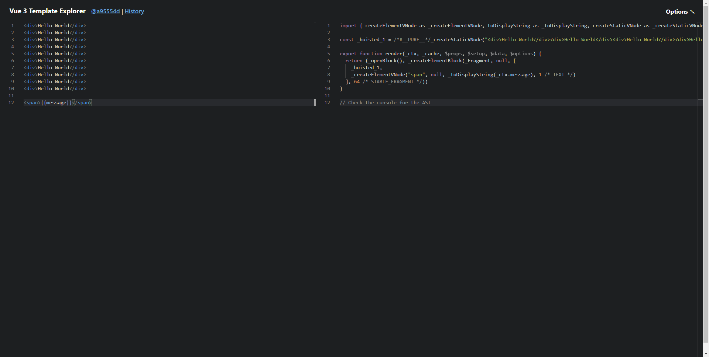
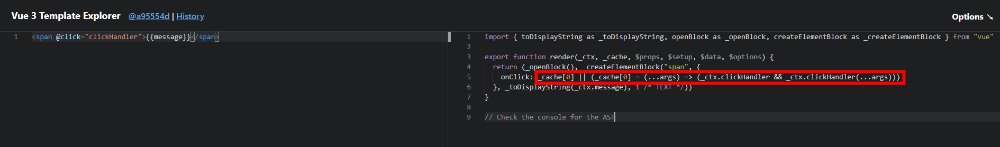

## Vue3 比 Vue2 有什么优势?

- 性能更好
- 体积更小
- 更好的 ts 支持
- 更好的代码组织
- 更好的代码抽离
- 更多的新功能

## 描述 Vue3 生命周期

> Options API 生命周期（兼容 Vue2 的语法）

- beforeDestroy 改为 beforeUnmount
- destroyed 改为 unmounted
- 其它沿用 Vue2 的生命周期

## 如何看待 Composition API 和 Options API?

> Composition API 带来了什么？

- 更好的代码组织(代码阅读性，代码结构性更好，抽离函数，变量申明，使用都在一块儿，不像 Options API 那样 data 申明变量，computed 和 methods 中使用 变量。)
- 更好的逻辑复用
- 更好的类型推导 （Options API 中 data 中声明的变量 和 methods 中定义的函数 在声明周期 和 methods 函数中 都可以通过 this.属性名 访问和查找，这种语法直观上很不符合 JS 的原型继承逻辑，有悖于 JS 的 属性查找的理念。而 Composition API 中摈弃了 Vue2 中的 this, 而是 在 生命周期中 直接 引用 函数就可以，通过函数返回值来 查找 变量的声明和定义修改，这种方式更符合 JS 的类型推导，更方便的去 推导 变量的生命周期）

> Composition API 和 Options API 如何选择

类似于 React 的 class 语法 和 React hooks

- 不建议共用，会引起混乱
- 小型项目，业务逻辑简单，用 Options API
- 中大型项目，逻辑复杂，用 Composition API

> 别误解 Composition API

- Composition API 属于高阶技巧，不是基础必会

- Composition API 是为解决复杂业务逻辑而设计

- Composition API 就像 Hooks 在 React 中的地位（高阶技巧，它不会影响框架的一些基础使用，不用它也可以）

## 如何理解 ref toRef 和 toRefs?

[ref sugar]

**ref**

- 是什么

  - 生成值类型的响应式数据
  - 可用于模板 和 reactive
  - 通过 .value 修改值

- 最佳使用方式
- 进阶，深入理解

**toRef**

- 针对一个响应式对象(reactive 封装)的 prop
- 创建一个 ref，具有响应式
- 两者保持引用关系

> toRef 如果用于普通对象（非响应式对象），产出的结果不具备响应式

**toRefs**

- 将响应式对象（reactive 封装）转换为普通对象
- 对象的每个 prop 都是对应的 ref
- 两者保持引用关系

**toRef 和 toRefs 的最佳使用方式**

- 用 reactive 做对象的响应式，用 ref 做值类型响应式
- setup 中返回 toRefs(state),或者 toRef(state,'xxx')
- ref 的变量命名都用 xxxRef

**最佳使用方式**

- 合成函数返回响应式对象,使用 toRefs

```js
function useFeatureX() {
  const state = reactive({ x: 1, y: 2 })

  // 逻辑运行状态，省略N行

  // 返回时转换未 ref
  return toRefs(state)
}

export default {
  setup() {
    // 可以在 不失去响应式的情况下破坏结构
    const { x, y } = useFeatureX()

    return { x, y }
  }
}
```

> 为何需要 ref ?

- 在 setup 中直接返回值类型，会丢失响应式
- Proxy 响应式对于非对象失效，不适用值类型
- 如在 setup、computed、合成函数，都有可能返回值类型
- Vue 如果不定义 ref,用户将自创 ref,反而混乱

> 为何 ref 需要 .value ?

- ref 是一个对象(不丢失响应式),通过对象.value 存储值(对象存储引用类型的引用地址)
- 通过 .value 属性的 get 和 set 实现响应式
- 用于 模板、reactive 时，不需要 .value,其它情况都需要

> 为何需要 toRef toRefs ?

- 初衷： 不丢失响应式的情况下，把对象数据 **分解/扩展 解构**
- 前提： 针对的是响应式对象（reactive 封装的），非普通对象
- 注意： 不创造响应式,而是 延续响应式

## Vue3 升级了哪些重要的功能

- createApp
- emits 属性
- 生命周期
- 多事件
- Fragment
- 移除 .sync
- 异步组件的写法
- 移除 filter
- Teleport
- Suspense
- Composition API

### createApp

```JS
// vue2.x

Vue.use(/* ... */)
Vue.mixin(/* ... */)
Vue.component(/* ... */)
Vue.directive(/* ... */)

const appV2 = new Vue({ /* 选项 */})

// vue3.x

const appV3 = createApp({/* 选项 */})

appV3.use(/* ... */)
appV3.mixin(/* ... */)
appV3.component(/* ... */)
appV3.directive(/* ... */)

```

### emits 属性

```vue

// 父组件
<template>
  <HelloWorld :msg="msg" @sayHello="sayHello">
</template>

// 子组件
<script>
export default {
  name:'HelloWorld'，
  props:{msg:String},
  emits:['sayHello'],
  setup(props,{emit}){
    emit('sayHello','bbb')
  }
}
</script>
```

### 多事件处理

```vue
<template>
  <!-- 这两个 one() 和 two() 将执行按钮点击事件 -->
  <button @click="one($event), two($event)">Submit</button>
</template>

<script>
export default {
  ...,
  methods:{
     one(event) {
    // 第一个事件处理器逻辑...
  },
  two(event) {
   // 第二个事件处理器逻辑...
  }
  }
}
</script>
```

### Fragment

```vue
// vue2.x 组件模板
<template>
  <div class="blog-post">
    <h3> {{title}} </h3>
    <div v-html="content"></div>
  </div>
</template>


// vue3.x 组件模板
<template>
    <h3> {{title}} </h3>
    <div v-html="content"></div>
</template>
```

### 移除 .sync

```vue

<!-- vue2.x -->
<MyComponent v-bind:title.sync="title" />

<!-- vue3.x -->
<MyComponent v-model:title="title" />
```

### 异步组件

```vue
<!-- vue 2.x 写法 -->

new Vue({
  ...,
  components:{
    'my-component':()=>import('./my-async-component.vue')
  }
})

<!-- vue 3.x 写法 -->
import {creareApp,defineAsyncComponent} from 'vue'

createApp({
  ...,
  components:{
    AsycnComponent:defineAsyncComponent(()=>import('./components/AsycnComponent.vue'))
  }
})

```
### 移除 filter

```vue
<!-- 以下 filter 在 vue 3 中 均不可用了 -->

<!-- 双括号中 -->
{{message | capitalize}}

<!-- 在 v-bind 中 -->
<div v-bind:id = "rawId | formatId">
```

### Teleport

```vue
<!--  data 中设置 modalOpen: false -->
<template>
  <button @click="modalOpen = true">
      Open full screen modal! (With teleport!)
  </button>

  <teleport to="body">
      <div v-if="modalOpen" class="modal">
        <div>
          I'm a teleported modal!
          (My parent is "body")
          <button @click="modalOpen = false">
            Close
          </button>
        </div>
      </div>
    </teleport>
</template>

```

### Suspense

```
<Suspense>
  <template>
    <Test1 /> <!-- 是一个异步组件 -->
  </template>
  <!-- # fallback 就是一个具名插槽，即 Suspense 组件内部，有两个 slot,其中一个具名 未 fallback -->
  <template #fallback>
    loading...
  </template>
</Suspense>

```

## Composition API 如何实现代码逻辑复用

- 抽离逻辑代码到一个函数
- 函数命名约定未 useXxxx 格式（React Hooks 也是）
- 在setup 中引用 useXxxx 函数

## Vue3 如何实现 响应式？

**Object.defineProperty 的缺点**
- 深度监听需要一次性递归
- 无法监听新增属性/删除属性(Vue.set Vue.delete)
- 无法原生监听数组，需要特殊处理

**Proxy实现响应式**

- 深度监听,性能更好
- 可监听 新增/删除 属性
- 可监听数组变化

> Proxy 能规避 Object.defineProperty 的问题;
> Proxy 无法兼容所有浏览器，无法 polyfill

**Reflect作用**
- 和 Proxy 能力 一一对应
- 规范化、标准化、函数式
- 替代掉 Object 上的工具函数

```javascript

const obj = {a:100,b:200,a1:10,b1:20}

Object.getOwnPropertyNames(obj) // ["a","b","a1","b1"]

Reflect.ownKeys(obj) // ["a","b","a1","b1"]

'a' in obj  // true

Reflect.has(obj,'a')  // true

delete obj.a1

Reflect.deleteProperty(obj,'b1')

```

## v-model参数的用法

- [vue2中的 .sync 修饰符](https://cn.vuejs.org/v2/guide/components-custom-events.html#sync-%E4%BF%AE%E9%A5%B0%E7%AC%A6)

```
<text-document
  v-bind:title="doc.title"
  v-on:update:title="doc.title = $event"
></text-document>

// 等价于

<text-document v-bind:title.sync="doc.title"></text-document>

```

- [vue3中的v-model 参数]

```
<ChildComponent v-model:title="pageTitle" />

<!-- 是以下的简写 -->
<ChildComponent :title="pageTitle" @update:title="pageTitle=$event"
```

## watch 和 watchEffect 的区别是什么？

- 两者都可监听data 属性变化
- watch 需要明确监听哪个属性
- watchEffect 会根据其中的属性，自动监听其变化

## setup 中如何获取组件实例

- 在 setup 和 其他 Composition API 中没有 this
- 可通过 getCurrentInstance 获取当前组件实例
- 若使用 Options Api 可照常使用 this

## Vue3 为何比 Vue2 快

- Proxy 响应式 性能 优于 Object.defineProperty
- PatchFlag
- hoistStatic
- cacheHandler
- SSR 优化
- tree-shaking

### PatchFlag

[代码演示](https://vue-next-template-explorer.netlify.app/)

- 编译模板时，动态节点标记
- 标记，分位不同的类型，如 TEXT PROPS
- diff算法时，可以区分静态节点，以及不同类型的动态节点


### hoistStatic 静态提升

Vue3 中对不参与更新的元素，会做静态提升，只会被创建一次，在渲染时直接复用。

- 将静态节点的定义，提升到父作用域，缓存起来
- 多个相邻的静态节点，会被合并起来
- 典型的拿空间换时间的优化策略




### cacheHandler

- 缓存事件



### SSR 优化

- 静态节点直接输出，绕过了 vdom
- 动态节点，还是需要动态渲染


### tree shaking 优化

Vue2中，无论我们使用什么功能，它们最终都会出现在生产代码中。主要原因是Vue实例在项目中是单例的，捆绑程序无法检测到该对象的哪些属性在代码中被使用到

```js
import Vue from 'vue'

Vue.nextTick(() => {})
```

而Vue3源码引入tree shaking特性，将全局 API 进行分块。如果你不使用其某些功能，它们将不会包含在你的基础包中

```js
import { nextTick, observable } from 'vue'

nextTick(() => {})
```

## vite 是什么

- vite 是一个前端打包工具，Vue作者发起的一个项目
- 借助Vue的影响力，发展较快，和webpack竞争
- 优势：开发环境无需打包，启动快

> vite 为何启动快？
开发环境使用ES6 Module, 无需打包 --- 非常快(不用像 webpack 那样，需要将代码编译成 ES5 语法)
生产环境使用 rollup打包，并不会快很多


## Composition API 和 React Hooks 的对比

- 前者 setup 只会被调用一次，而后者函数会被多次调用
- 前者无需 useMemo useCallback, 因为 setup 只会被调用一次
- 前者无需顾虑调用顺序，而后者需要保证 hooks 的顺序一致
- 前者 reactive +  ref 比后者 useState,要难理解
